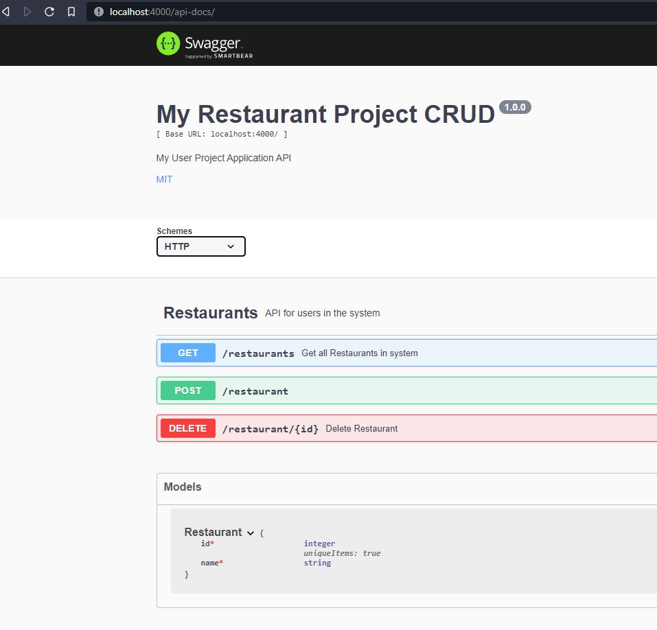

1. download files
2. run npm install to install dependencies from package.json
3. run npm start to run start script in package.json
4. open localhost:4000/api-docs to see swagger api docs
5. open localhost:4000/restaurants to view list of restaurants

